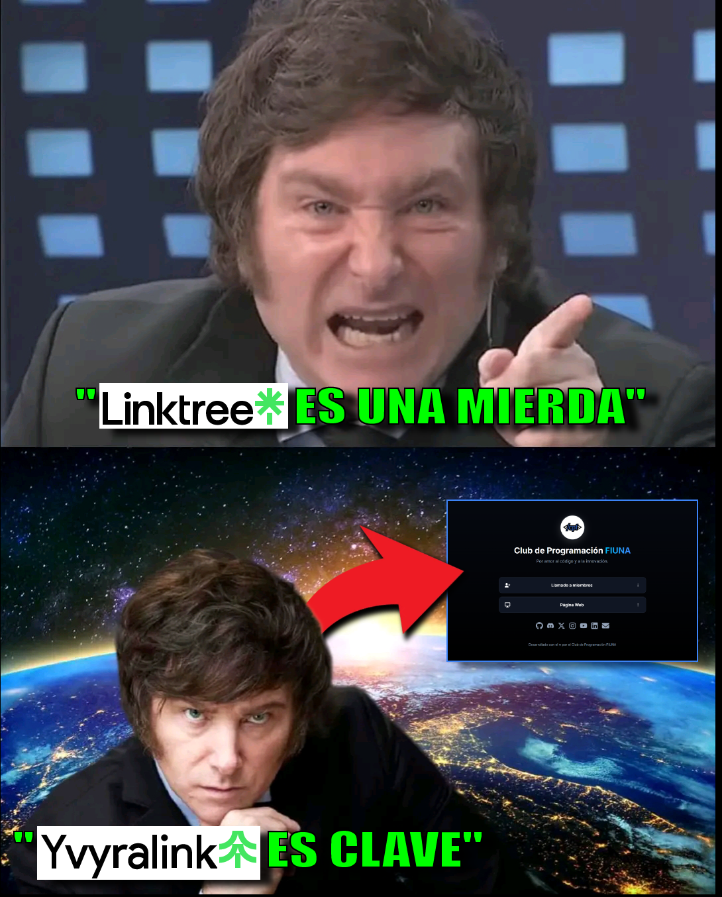

# Yvyralink - Linktree humilde

<div align="center">



</div>

### ¿Qué gua'u es esto?

Yvyralink _(cariñosamente Linktreen't)_ es un clon de Linktree _(de escasos recursos)_ desarrollado por el **Club de Programación FIUNA**. 

Su propósito es ofrecer un lugar claro y controlado donde centralizar enlaces importantes del club (formularios, Discord, GitHub, redes sociales, etc.).

### ¿Por qué gua'u hicimos esto?

Debido a su nueva política de publicidad más agresiva, al usar Linktree algunos alumnos se confundían con un gran botón que aparece en la interfaz que decía "Únete a cpfiuna en Linktree" (o similar). 

Ese botón dirige a la creación de una cuenta en Linktree y no al formulario de postulación del club. Muchos estudiantes terminaban creando cuentas en Linktree en lugar de completar el formulario correcto.

Este clon elimina esa ambigüedad: los enlaces personalizados llevan directamente a los recursos correctos (p. ej. el formulario de inscripción), sin CTAs externos que desvíen a los usuarios.

## Características

- Interfaz limpia y enfocada en links.
- Botón de copiar con detección de "presionar y mantener" para evitar copias accidentales en móviles.
- Iconos sociales estilizados y ordenables según la estrategia del club.
- Fácil personalización desde `src/pages/Index.tsx`.

## Estructura

- `src/pages/Index.tsx`: archivo principal donde se definen `socialLinks` y `links` y donde se encuentran los handlers de copia y estilos.
- `src/index.css`, `tailwind.config.ts`: configuración y estilos globales.

## Ejecutar

Instalá las dependencias y ejecutá el servidor de desarrollo:

```powershell
npm install
npm run dev
```

Abrí `http://localhost:5173` (o el puerto que indique Vite) en tu navegador.

## Construir

```powershell
npm run build
npm run preview
```

## Contribuir

1. Abre un issue describiendo tu propuesta o bug.
2. Haz un fork y crea una rama con cambios pequeños y claros.
3. Envía un Pull Request con descripción y pruebas si aplica.

## Contacto

<div align="center">

  [](https://instagram.com/cpfiuna)
  [](https://x.com/cpfiuna)
  [](https://discord.gg/UtRpKw2ay4)
  [](https://youtube.com/@cpfiuna)
  [](https://linktr.ee/cpfiuna)

  Visitá nuestra [página web :)](https://cpfiuna.io)

</div>

